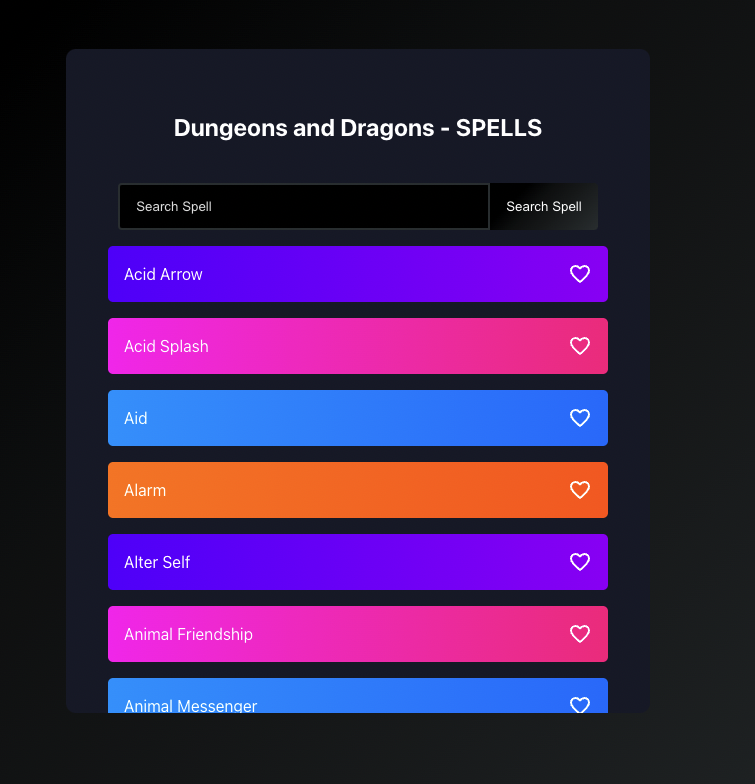

# React App Code Test

This project was bootstrapped with [Create React App](https://github.com/facebook/create-react-app).




## How to run  

**Step 1:**

Download or clone this repo by using the link below:

```
git clone https://github.com/Sherange-Swivel/dungeons-and-dragons-app
```

**Step 2:**

Go to project root and execute the following command in console to get the required dependencies: 

```
yarn install 
```

**Step 3:**

Execute the following command to run project:

```
yarn start
```

<br></br>
## Available Scripts

In the project directory, you can run:

```
yarn start
```

Runs the app in the development mode.\
Open [http://localhost:3000](http://localhost:3000) to view it in the browser.


```
yarn test
```

Launches the test runner in the interactive watch mode.\
See the section about [running tests](https://facebook.github.io/create-react-app/docs/running-tests) for more information.

<br></br>
## App Features:

* Home Sceem - Spell List
* Detail View - Spell View

<br></br>
### Libraries & Tools Used

* [Redux Toolkit](https://redux-toolkit.js.org)
* [React Router](https://v5.reactrouter.com/web/guides/quick-start)
* [React Icons ](https://react-icons.github.io/react-icons/)

<br></br>
### Folder Structure

Folder structure used in this project

```
src/
|- components/
|- constants/
|- redux/
|- pages/
|- App.tsx
```

Now, lets dive into the lib folder which has the main code for the application.

```
1 components 
  - Contains the common UI components of the application like Loaders Buttons InputFields
2 constants 
  - All the application level constants are defined in this file. contains the constants for `urls` and `strings`
3 redux
  — Contains the redux store of the application and redux-slice that comes with reducers and action dispatchers .
4 pages
  — Contains the screen UIs and components for the specific screen. For example, Home etc.
5 App.tsx
  - This is the starting point of the application. All the application level configurations are defined in this file i.e, Providers, Navigation 
```
